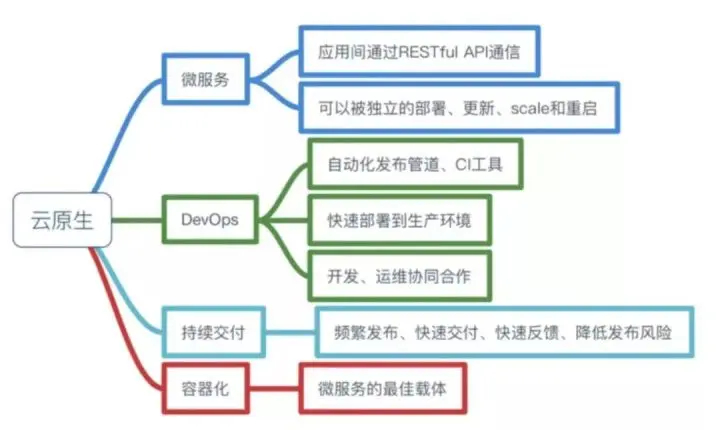

# 云原生前世今生

云原生 CloundNative，为云而生，是一种技术路线和方法论，核心理念就是探索如何让应用充分发挥云平台的优势。

由于云原生只是一个笼统的概念，各个公司和组织出于不同立场对云原生理念有不同的解读，目前没有一个统一的标准。

在这里简单介绍下比较知名的云原生玩家。

## Pivotal
2013年，曾推出Spring系列框架的Pivotal公司，其技术经理Matt Stine首次提出云原生（CloudNative）的概念。

2015年，Matt Stine在《Migrating to Cloud Native Application Architectures - 迁移到云原生应用架构》书中定义了云原生架构的几个特征
> * 符合[12模式](https://wujin-master.github.io/p/12%E8%A6%81%E7%B4%A0%E5%BA%94%E7%94%A8/ "云原生15要素")
> * 微服务架构,独立部署的服务，一次只做一件事
> * 自助服务敏捷基础设施,用于快速、可重复和一致地提供应用环境和服务的平台
> * 面向API接口的通信,服务之间的交互基于接口，而不是本地方法调用
> * 抗脆弱性，系统能抵御高负载

2017年，Matt Stine 在接受 InfoQ 采访时将云原生架构的定义做了调整：

> * 模块化（Modularity）
> * 可观测性（Observability）
> * 可部署性（Deployability）
> * 可测试性（Testability）
> * 可处理性（Disposability）
> * 可替代性（Replaceability）

2019年，Pivotal被 VMware Tanzu 收购，在官网将云原生的定义，以及云原生的架构原则浓缩为4点：
> * DevOps
> * 持续交付
> * 微服务
> * 容器

目前，VMware Tanzu 官网对云原生的最新定义为：
> * 云原生是一种使用云计算方法和工具来开发、部署和运行应用程序的方法。从根本上说，云原生是关于构建团队、文化和技术，以利用现代架构和先进的自动化来管理复杂性并提高软件开发速度。
> * 使用云原生架构构建和运营应用程序的组织能够更快地将新想法推向市场并更快地响应客户需求。云原生应用程序的构建是为了利用容器、Kubernetes 和 Kubernetes 生态系统等核心技术。云原生开发（现代开发）融合了DevOps、持续集成和持续交付（CI/CD）的概念，并拥抱包括微服务和无服务器在内的现代架构。
> * 云原生开发是关于如何创建和部署应用程序，而不是在哪里创建和部署应用程序。无论您是在本地、公共云中部署，还是使用混合或多云模型，按需计算能力以及对现代数据服务和应用程序服务的访问都是成功的关键。
> 
> (https://tanzu.vmware.com/cloud-native)

## CNCF
2015年，Google、RedHat 等公司共同牵头成立了一家基金会，出于对docker在容器领域一家独大的不满，将云原生定义为：
> * 微服务架构
> * 应用容器化
> * 支持容器编排和容器调度
可以看到，CNCF在除了微服务架构和容器化之外，特意将容器编排和容器调度加了进来。

2018年，主流云计算供应商相继加入，CNCF又更新了云原生的定义，目前CNCF对的最新定义为：
> * 云原生技术有利于各组织在公有云、私有云和混合云等新型动态环境中，构建和运行可弹性扩展的应用。云原生的代表技术包括容器、服务网格、微服务、不可变基础设施和声明式API。
> * 这些技术能够构建容错性好、易于管理和便于观察的松耦合系统。结合可靠的自动化手段，云原生技术使工程师能够轻松地对系统作出频繁和可预测的重大变更。
> * 云原生计算基金会（CNCF）致力于培育和维护一个厂商中立的开源生态系统，来推广云原生技术。我们通过将最前沿的模式民主化，让这些创新为大众所用。
> (https://github.com/cncf/toc/blob/main/DEFINITION.md)

随着CNCF旗下的kubernetes项目成为事实上的容器编排标准，当前的云上应用，不论是公有云还是私有云还是混合云，都离不开kubernetes平台，CNCF对云原生的定义也有了充分的话语权。

## 结束语
云原生没有放之四海的标准，甚至软件技术也不存在标准，适合的就是最好的，他山之石可以攻玉，但也同样不要迷信权威，每家厂商/组织都要寻找到适合自己的技术路线和标准。